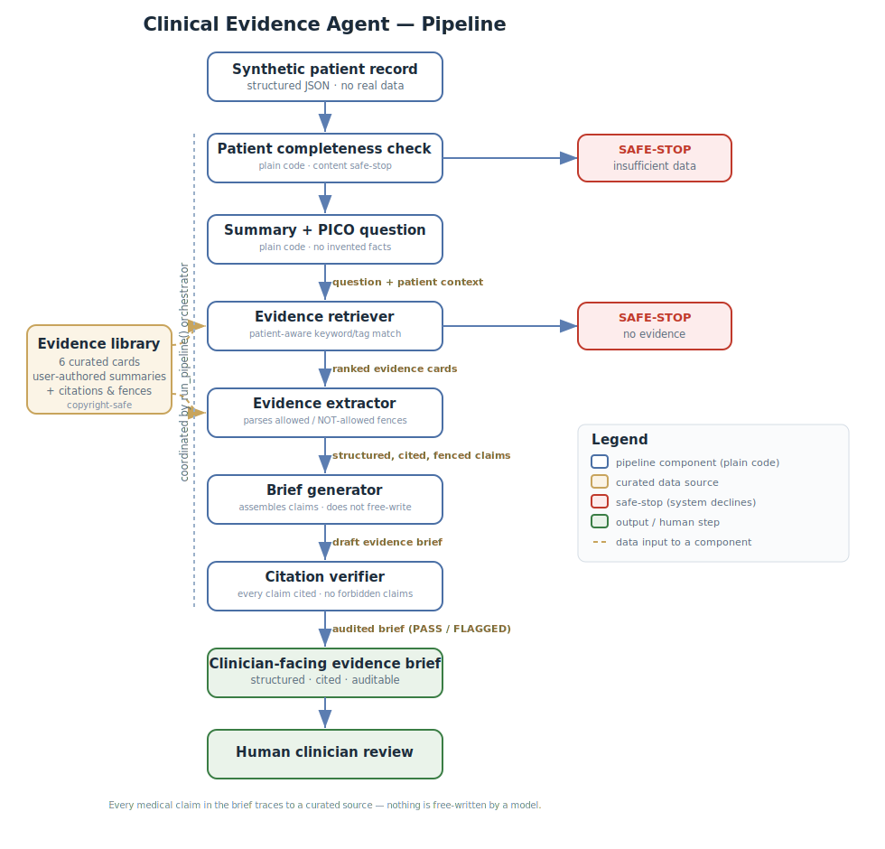

# AI Clinical Evidence Agent — Treatment Option Review

A clinician-facing prototype that summarizes a **synthetic** patient profile,
retrieves trusted medical evidence, compares treatment options, and produces a
**cited, audited evidence brief for physician review**.

> **For clinician review only. Synthetic data. Not medical advice.**
> This prototype does not diagnose, prescribe, or recommend a final treatment.
> It is a portfolio project, not a clinical system, and is not intended,
> validated, or cleared for real clinical use.

---

## What this is

An end-to-end, retrieval-augmented pipeline that helps organize medical evidence
for a clinician's independent review. It takes a structured (synthetic) patient
record and produces a governed evidence brief in which **every medical claim is
traceable to a curated source**, and the system **declines to answer** when it
lacks either evidence or sufficient patient information.

Version 1 scope: **knee osteoarthritis** treatment-option review.

## What this is NOT

- Not for real clinical use, and not medical advice.
- Does not diagnose, prescribe, or select a final treatment.
- Does not use real patient data or connect to an EHR.
- Does not state success rates unless a cited source explicitly reports them.

## Why this design

The goal is a **transparent, auditable, human-in-the-loop** evidence assistant —
not an autonomous "AI doctor." The design follows the principle that a clinician
must be able to independently review the basis for any output. Concretely:

- **Answers only from a curated evidence library**, never from unsupported model memory.
- **Every claim carries a citation**; an automated verifier enforces this.
- **Two safe-stops** ensure the system refuses to over-answer.
- **Cautious, non-directive language** throughout ("may be considered", not "should").

---

## Architecture


The pipeline is coordinated by a single `run_pipeline()` orchestrator and can end
in three ways: a verified brief, a **no-evidence** safe-stop, or an
**insufficient-patient-data** safe-stop.

## Key design decisions

- **Transparent keyword/tag retrieval over semantic search (v1).** Chosen for
  auditability — you can always see *why* a source was selected. Semantic search
  is a planned v2 upgrade.
- **Copyright-safe evidence library.** Each source is an original, user-authored
  summary of a real, verified source (with citation and link) — no copyrighted
  text is reproduced. Each card declares explicit "claims allowed" and "claims
  NOT allowed" fences.
- **Assembly over generation.** The brief is assembled from pre-extracted, cited
  claims rather than free-written by a model, so groundedness is structural.
- **Tested guardrails.** The citation verifier is validated by injecting a known
  forbidden claim and confirming it is caught.

## Three patient outcomes (demonstrated)

| Patient | Record | Outcome |
|---------|--------|---------|
| SYN-KOA-001 | Severe OA, failed conservative care, comorbidities | Full verified brief |
| SYN-KOA-002 | Moderate OA, minimal prior treatment | Conservative-leaning brief |
| SYN-KOA-003 | Sparse record (extensive missing data) | **Declined** — insufficient data |

## Safety evaluation

An evaluation notebook (`notebooks/06_evaluation.ipynb`) runs an 8-test safety
suite: full-brief generation, content safe-stop, every-claim-cited,
forbidden-claim detection, no invented success rates, missing-info surfacing,
input-responsiveness, and citation integrity. **Result: 8/8 passed.**

---

## How to run

```bash
# 1. Create and activate a virtual environment
python -m venv venv
venv\Scripts\activate        # Windows (use source venv/bin/activate on Mac/Linux)

# 2. Install dependencies
pip install -r requirements.txt

# 3. Run the web app
streamlit run app.py

# Or run the pipeline directly for one patient:
python src\orchestrator.py

# Or run the safety test suite:
#   open notebooks/06_evaluation.ipynb and Run All
```

## Repository structure

```text
clinical-evidence-agent/
├── app.py                       # Streamlit front end
├── data/
│   ├── patients/                # Synthetic patient records
│   └── evidence/
│       ├── summaries/           # Curated evidence cards (user-authored)
│       └── evidence_catalog.csv # Source index
├── src/
│   ├── patient_summary_agent.py
│   ├── question_builder.py
│   ├── evidence_retriever.py
│   ├── evidence_extractor.py
│   ├── patient_completeness.py
│   ├── brief_generator.py
│   ├── citation_verifier.py
│   └── orchestrator.py          # Coordinates the full pipeline
├── notebooks/
│   └── 06_evaluation.ipynb      # 8-test safety suite
├── outputs/                     # Generated evidence briefs
├── docs/
│   ├── architecture.svg
│   └── risk_and_safety_notes.md
└── README.md
```

## Limitations

- The evidence library is small and curated, not a live search of all literature;
  relevant evidence may be missing.
- Retrieval uses keyword/tag matching, which cannot resolve synonyms or judge
  semantic relevance the way embeddings can.
- The citation verifier performs **structural** checks (is a claim cited? does it
  cross a declared fence?), not deep semantic entailment.
- Synthetic data only; outputs demonstrate workflow and guardrails, not clinical accuracy.

## Future work (v2)

- **Semantic retrieval** via embeddings, replacing keyword matching.
- **Entailment-based citation verification** — checking that a cited source truly
  supports each specific claim, not just that a citation is present.
- **Richer patient-completeness handling** — currently keyword retrieval treats a
  sparse record and a rich record similarly at the retrieval stage; the
  content safe-stop compensates, but a fuller version would weight retrieval by
  record completeness.
- Additional conditions beyond knee osteoarthritis.

---

*Built as a portfolio project to demonstrate a governed, auditable,
human-in-the-loop clinical evidence-support workflow.*